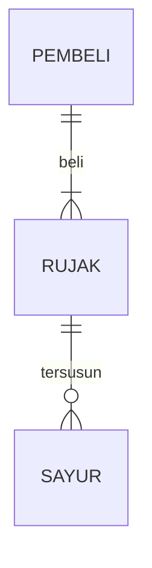

## 1.1 Latar Belakang

 dilihat dari apa yang terjadi saat ini, pola hidup orang orang didunia, semakin berkembangnya teknologi didunia, apa apa semakin mudah, orang orang bukannya memanfaatkan hal itu dengan baik, malah sebaliknya, semakin hidup dipermudah, semakin banyak orang orang yang menyia-nyiakan hal itu. pola hidup orang-orang saat ini tergolong tidak sehat, entah itu hidup boros, jarang olahraga dan masih banyak lagi, dan pola hidup yang tidak sehat dapat berdampak negatif pada kesehatan fisik dan mental. oleh karena itu, saya membuat website yang bertujuan untuk mengedukasi semua orang atau pengguna agar mereka mulai dengan perlahan menjalankan pla hidup yang sehat. good habits adalah website yang dibuat bertujuan untuk memberikan dampak baik untuk para pengguna, sehingga pengguna mendapatkan hidup yang teratur dan terstruktur, website ini memberikan edukasi dan menuntun pengguna agar pengguna perlahan bisa berubah menjadi lebih baik.  
## 1.2. Deksripsi Teknologi Informasi

website ini bertujuan untuk memberikan edukasi para pengguna agar perlahan mereka bisa menjalankan atau merubah pola hidup yang sehat dan lebih baik.

## 1.3. Branding

pada tahap ini saya akan mengeksplorasi branding dari produk yang saya buat.

-Merk : goodHABITS

-Tagline : Make your life better

-campaign : bagaimana membuat aplikasi/website yang penggunanya dapat menggunakan beberapa fitur yang dapat diakses oleh semua pengguna (ada beberapa fitur yang dapat diakses jika user sudah login), gunanya untuk mengedukasi pengguna agar memiliki pola hidup yang sehat.

-target user :
	
 *usia 10+ 
 
 *pengguna mendapatkan beberapa informasi mengenai pola hidup sehat, 
 
 *pengguna dapat mengeksplorasi beberapa cara agar memiliki pola hidup yang sehat, 
 
 *terdapat beberapa fitur yang bisa digunakan sebagai kebutuhan pengguna dalam proses merubah kebiasaan hidup,
  
-UX theme : 
  
  *simple
	
 *warna tidak mencolok
	
 *fitur mudah
	
 *to the point
 
-*tidak ada inspirasi desain, membuat sendiri

## 2. User Story

Sebagai | Saya ingin bisa | Sehingga | Prioritas
---|---|---|---
Pengguna | mengakses fitur atau menu dalam website | bisa menjalankan dam mengakses apa saja yang ada didalam beberapa fitur/menu tersebut | ⭐⭐⭐⭐⭐
Pengguna | Register | Bisa mendaftarkan akun dan biodata diri, agar dapat memasukan akun kedalam menu login | ⭐⭐⭐⭐⭐
Pengguna | Login | Bisa mengakses semua fitur yang tersedia pada website | ⭐⭐⭐⭐
Pengguna | Menjalankan beberapa fitur dan menggunakannya dengan baik  | sehingga | ⭐⭐⭐⭐
Pengguna | Mengakses menu utama | Membaca artikel atau beberapa cara yang disarankan agar memiliki pola hidup yang sehat | ⭐⭐⭐
Pengguna | Mengakses menu menabung | Pengguna dapat membuat daftar pemasukan dan pengeluaran harian agar tabungannya teratur dan terdata dengan baik | ⭐⭐⭐
Pengguna | Mengakses menu olahraga | Pengguna dapat melakukan olahraga harian secara teratur dan terstruktur | ⭐⭐⭐
Pengguna | Mengakses menu list harian | Pengguna dapat melakukan list harian atau mencatat kegiatan harian agar pengguna memiliki jadwal kegiatan yang terstruktur | ⭐⭐⭐
Pengguna | memasukan foto profil hingga data diri  | Pengguna dapat memasukan data diri dan foto profil sesuka hati pengguna | ⭐⭐
Pengguna | Mengubah foto profil hingga data diri | Pengguna dapat melakukan perubahan pada identitas diri dan foto profil tanpa adanya keterbatasan | ⭐⭐
Pengguna | Melihat menu saldo tabungan | Pengguna dapat mengetahui jumlah pemasukan dan pengeluaran| ⭐⭐
Pengguna | Memasuki halaman resep makanan | Pengguna dapat melihat beberapa menu mudah yang telah disarankan | ⭐

## 3. Struktur Data

Cara membuat aneka macam bentuk grafik menggunakan mermaid.js bisa lihat di [https://mermaid.js.org/syntax/entityRelationshipDiagram.html](https://mermaid.js.org/syntax/entityRelationshipDiagram.html) 

## 4. Arsitektur Sistem

Masih pake mermaid.js juga bisa lihat flowchart di [https://mermaid.js.org/syntax/flowchart.html](https://mermaid.js.org/syntax/flowchart.html)

## 5. Teknologi, Library, dan Framework

bla bla bla

## 6. Desain User Experience dan User Interface

Bisa load image 

