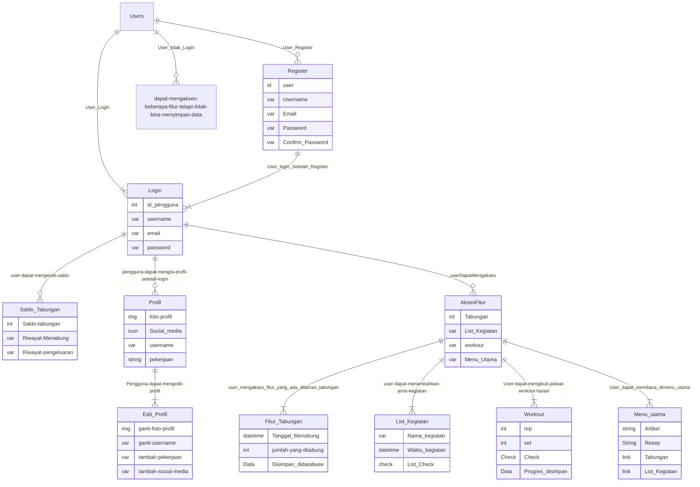
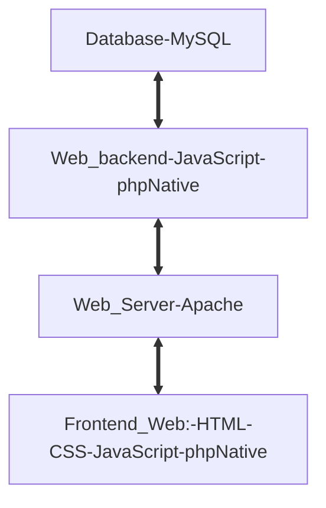

## 1.1 Latar Belakang

 dilihat dari apa yang terjadi saat ini, pola hidup orang orang didunia, semakin berkembangnya teknologi didunia, apa apa semakin mudah, orang orang bukannya memanfaatkan hal itu dengan baik, malah sebaliknya, semakin hidup dipermudah, semakin banyak orang orang yang menyia-nyiakan hal itu. pola hidup orang-orang saat ini tergolong tidak sehat, entah itu hidup boros, jarang olahraga dan masih banyak lagi, dan pola hidup yang tidak sehat dapat berdampak negatif pada kesehatan fisik dan mental. oleh karena itu, saya membuat website yang bertujuan untuk mengedukasi semua orang atau pengguna agar mereka mulai dengan perlahan menjalankan pla hidup yang sehat. good habits adalah website yang dibuat bertujuan untuk memberikan dampak baik untuk para pengguna, sehingga pengguna mendapatkan hidup yang teratur dan terstruktur, website ini memberikan edukasi dan menuntun pengguna agar pengguna perlahan bisa berubah menjadi lebih baik.  
## 1.2. Deksripsi Teknologi Informasi

website ini bertujuan untuk memberikan edukasi para pengguna agar perlahan mereka bisa menjalankan atau merubah pola hidup yang sehat dan lebih baik.

ada beberapa jenis teknologi inforamasi yang dipakai dalam pengerjaan produk teknologi informasi

1. untuk database saya menggunakan MySQL
2. Untuk tampilan website/frontend saya menggunakan HTML untuk kerangka CSS untuk menambahkan Style dan Javascript untuk menampilkan animasi dalam website tersebut
3. untuk back and saya menggunakan PHP native
4. untuk code editor saya menggunakan VSCode
5. untuk desain awal menggunakan figma
6. untuk mengerjakan semua ini saya menggunakan laptop asus yang menggunakan sistem operaasi windows

## 1.3. Branding

pada tahap ini saya akan mengeksplorasi branding dari produk yang saya buat.

-Merk : goodHABITS
kata goodHABITS diambil dari bahasa inggris yang artinya "kebiasaan baik" atau bisa diartikan sebagai pola hidup yang baik, sesuai dengan produk yang dibuat, yang tujuannya mengedukasi agar seseorang memiliki pola hidup yang baik

-Tagline : Make your life better

-campaign : bagaimana membuat aplikasi/website yang penggunanya dapat menggunakan beberapa fitur yang dapat diakses oleh semua pengguna (ada beberapa fitur yang dapat diakses jika user sudah login), gunanya untuk mengedukasi pengguna agar memiliki pola hidup yang sehat.

-target user :
	
 *usia 10+ 
 
 *pengguna mendapatkan beberapa informasi mengenai pola hidup sehat, 
 
 *pengguna dapat mengeksplorasi beberapa cara agar memiliki pola hidup yang sehat, 
 
 *terdapat beberapa fitur yang bisa digunakan sebagai kebutuhan pengguna dalam proses merubah kebiasaan hidup,
  
-UX theme : 
  
  *simple
	
 *warna tidak mencolok
	
 *fitur mudah
	
 *to the point
 
## Refernsi Design
Saya mengambil referensi warna dan layout dari kedua referensi tersebut

## 2. User Story

Sebagai | Saya ingin bisa | Sehingga | Prioritas
---|---|---|---
Pengguna | mengakses fitur atau menu dalam website | bisa menjalankan dam mengakses apa saja yang ada didalam beberapa fitur/menu tersebut | ⭐⭐⭐⭐⭐
Pengguna | Register | Bisa mendaftarkan akun dan biodata diri, agar dapat memasukan akun kedalam menu login | ⭐⭐⭐⭐⭐
Pengguna | Login | Bisa mengakses semua fitur yang tersedia pada website | ⭐⭐⭐⭐
Pengguna | Menjalankan beberapa fitur dan menggunakannya dengan baik  | sehingga | ⭐⭐⭐⭐
Pengguna | Mengakses menu utama | Membaca artikel atau beberapa cara yang disarankan agar memiliki pola hidup yang sehat | ⭐⭐⭐
Pengguna | Mengakses menu menabung | Pengguna dapat membuat daftar pemasukan dan pengeluaran harian agar tabungannya teratur dan terdata dengan baik | ⭐⭐⭐
Pengguna | Mengakses menu olahraga | Pengguna dapat melakukan olahraga harian secara teratur dan terstruktur | ⭐⭐⭐
Pengguna | Mengakses menu list harian | Pengguna dapat melakukan list harian atau mencatat kegiatan harian agar pengguna memiliki jadwal kegiatan yang terstruktur | ⭐⭐⭐
Pengguna | memasukan foto profil hingga data diri  | Pengguna dapat memasukan data diri dan foto profil sesuka hati pengguna | ⭐⭐
Pengguna | Mengubah foto profil hingga data diri | Pengguna dapat melakukan perubahan pada identitas diri dan foto profil tanpa adanya keterbatasan | ⭐⭐
Pengguna | Melihat menu saldo tabungan | Pengguna dapat mengetahui jumlah pemasukan dan pengeluaran| ⭐⭐
Pengguna | Memasuki halaman resep makanan | Pengguna dapat melihat beberapa menu mudah yang telah disarankan | ⭐
Pengguna | Log uot | Pengguna dapat mengeluarkan akun yang terkait didalam website | ⭐

## 3. Struktur Data

## 4. Arsitektur Sistem

## 5. Teknologi, Library, dan Framework

Saya menggunakan PHP NATIVE untuk merancang produk teknologi informasi.

## 6. Desain User Experience dan User Interface
https://www.figma.com/file/eoIku4dRjOtSuh9BZlMG42/Untitled?type=design&node-id=0-1&mode=design&t=qMqib32rPftQH9qb-0

preview website

Tampilan Awal

Tampilan login

tampilan register

tampilan tabungan

tampilan profil

selebihnya ada didalam figma yang dapat diakses melalui link diatas

## 7. Demonstrasi Video
DEMONSTRASI VIDEO
 	link : https://youtu.be/lcz7ZGJYOSo?feature=shared

## 8. Bagaimana mesin komputasi dan sistem operasi berperan dalam produk teknologi informasimu ?
mesin komputasi dan sistem operasi yang berperan dalam pembuatan website
	link yoytube : https://youtu.be/jW0v_CULJQc?feature=shared

## 9. Bagaimana algoritma, struktur data, dan bahasa pemrograman berperan dalam produk teknologi informasimu ?

 Algoritma,struktur data dan bahasa pemrograman yang berperan dalam pembuatan produk
 	LINK YOUTUBE :https://youtu.be/g_i2Rn-A62Y?feature=shared

## 10. Bagaimana metode pengembangan perangkat lunak / Software Development Life Cycle berperan dalam produk teknologi informasimu ?

Metode pengembangan perangkat lunak yang berperan dalam produk
	link youtube : https://youtu.be/viISXDTiV-c?feature=shared

## 11. Bagaimana database / sistem basis data berperan dalam produk teknologi informasimu ?

Database yang berperan dan ada didalam produk
	link youtube : https://youtu.be/-_CguoXDFM8?feature=shared
